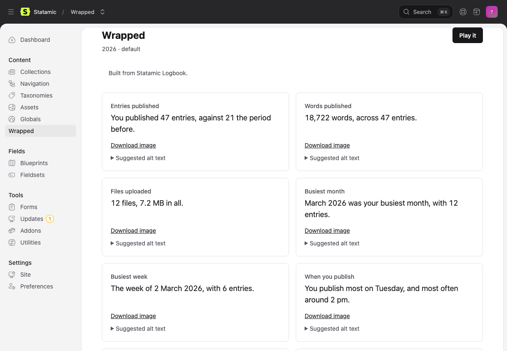
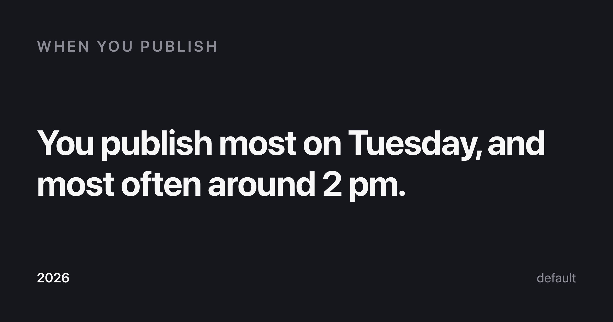
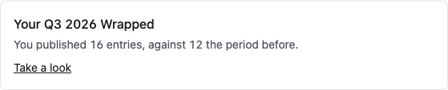
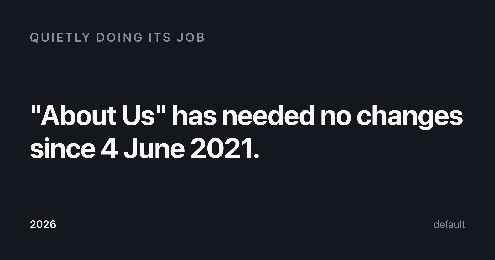
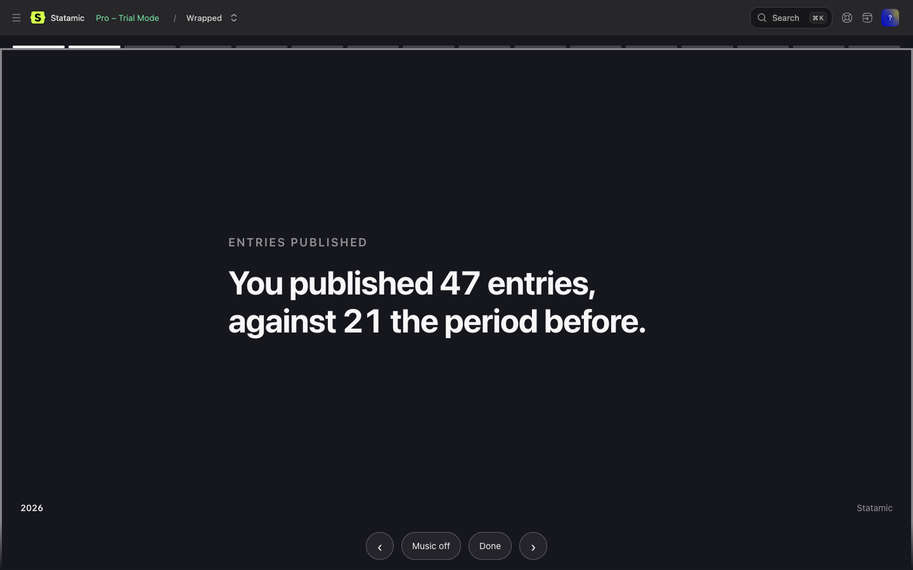
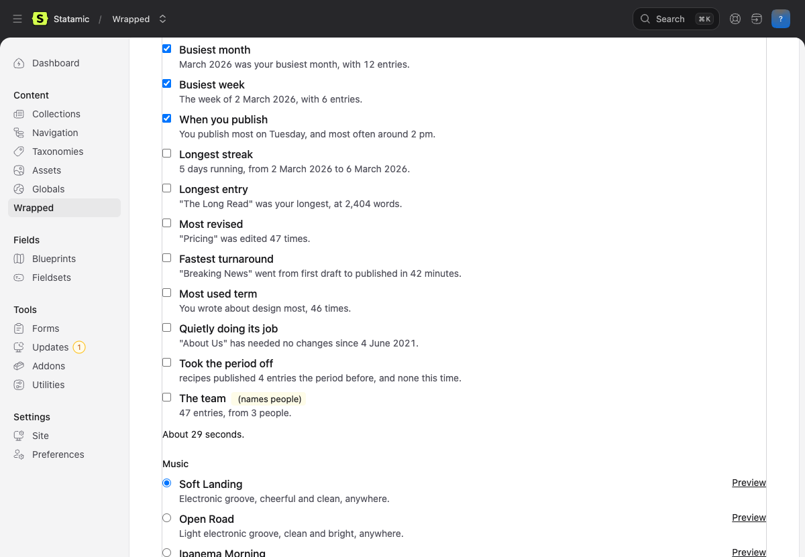
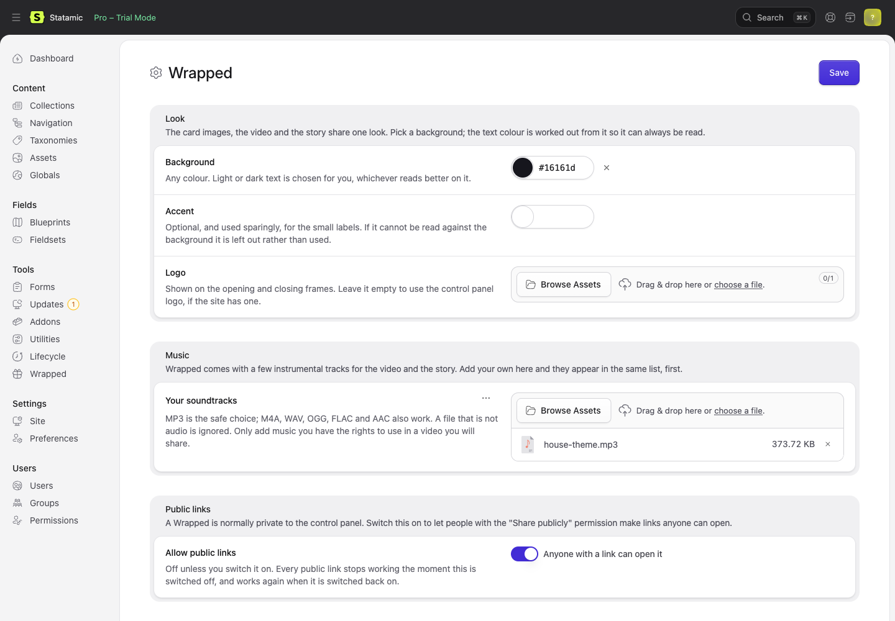
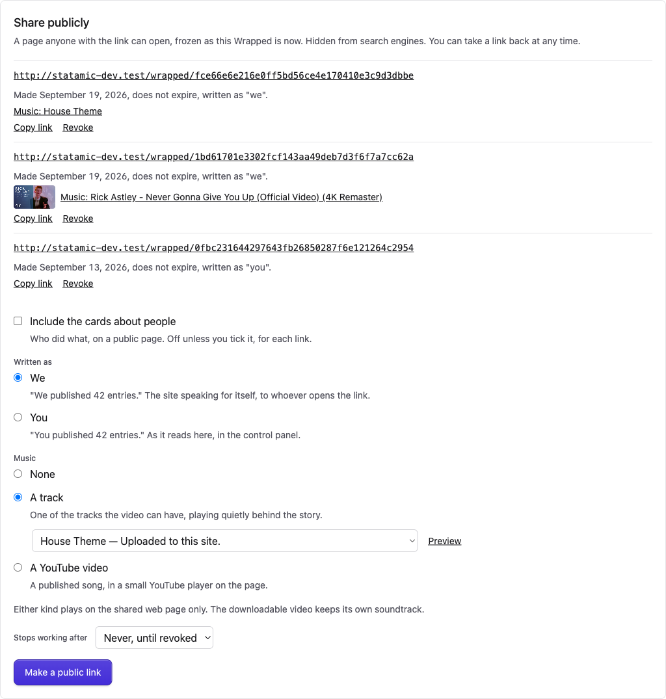
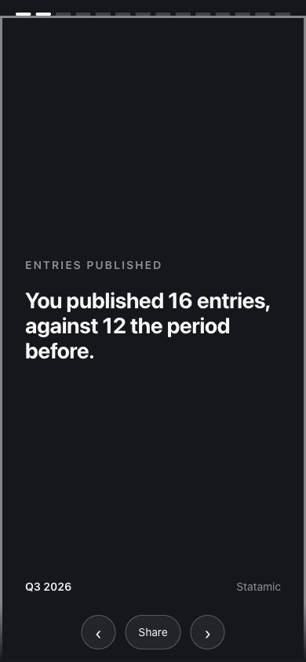

# Wrapped for Statamic

A year in review for your content team. What you published, when you were busiest, which page has been quietly doing its job since 2021. A dozen cards on a control panel screen, each one downloadable as a shareable image.

Free. Statamic 6. PHP 8.2+. Chrome for images and FFmpeg for video, both optional.



## What it shows

Roughly a dozen cards, in four groups. Every card is a sentence, not a chart.

| Group | Cards |
|---|---|
| **Volume** | Entries published (with last year alongside) · Words published · Files uploaded |
| **Time** | Busiest month · Busiest week · When you publish ("Tuesday afternoons") · Longest streak |
| **Superlatives** | Longest entry · Most revised · Fastest turnaround · Most used term · Quietly doing its job |
| **Collections** | Fastest growing · Took the period off |
| **People** | The team (on by default) · Top contributor (opt-in) |

The tone is warm on purpose. "This page has needed no changes since June 2021" is a compliment. Wrapped never scolds, never ranks anyone from the bottom, and never shows a number it cannot stand behind.



## Install

```bash
composer require bpmore/statamic-wrapped
php artisan migrate
```

Then build one:

```bash
php please wrapped:generate
```

It appears under **Tools → Wrapped** in the control panel nav. You can also build one from the screen itself, behind the **Build a Wrapped** permission.

For the dashboard widget, add it to the widgets in `config/statamic/cp.php`:

```php
'widgets' => [
    ['type' => 'wrapped', 'width' => 50],
],
```

It shows the headline number once there is a Wrapped to show, and nudges in December.



Upgrading, whenever the [changelog](CHANGELOG.md) says so:

```bash
php artisan migrate
php artisan vendor:publish --tag=wrapped --force
```

Upgrades never touch a Wrapped you have already built, and the settings screen keeps what you saved.

## Where the numbers come from

This is the part worth understanding. **Statamic does not reliably know its own edit history**, and every interesting card depends on it. Wrapped reads whichever of these your site has, best first:

| Source | What it knows | Confidence |
|---|---|---|
| [Statamic Logbook](https://statamic.com/addons/emran-alhaddad/statamic-logbook) | Who changed what, when — a full audit trail, including uploads | High |
| Revisions (Pro) | Every save of every entry in collections that have revisions on | Partial |
| Entry data | Each entry's publish date and last-updated stamp | Partial |
| File modification times | When a file was last written | Low |

**Every Wrapped says which one it used**, at the top of the screen. A card that needs better history than your site keeps is **left out rather than guessed at**. On a site with only file modification times, which most deploys rewrite, that means no cards at all and a plain explanation of why.

If you want the full set, install Logbook. It is free, and two of the cards (files uploaded, fastest turnaround) can only come from it.

## Generating

```bash
php please wrapped:generate                 # this year, every site
php please wrapped:generate --year=2025
php please wrapped:generate --quarter=3     # Q3 of this year
php please wrapped:generate --month=9       # September of this year
php please wrapped:generate --site=french
php please wrapped:generate --force         # rebuild one that already exists
```

One snapshot per site per period, cached in a table. Nothing is computed on page load.

There is a **Build** form on the Wrapped screen too, for a year, a quarter or a month of the site the control panel is looking at. It does the same work as the command and lands on what it built. It needs the **Build a Wrapped** permission, because it reads every entry on the site on demand; the schedule is still the usual way.

To have it ready when people come looking, schedule it for the first of December:

```php
// routes/console.php
Schedule::command('wrapped:generate')->yearlyOn(12, 1);
```

A busy site can add a monthly one on the first of each month, for the month just gone:

```php
Schedule::command('wrapped:generate', ['--month' => now()->subMonthNoOverflow()->month, '--year' => now()->subMonthNoOverflow()->year])->monthlyOn(1);
```

When there is more than one, a picker on the Wrapped screen chooses which to look at. The story, the images and the video follow it.

## Shareable images

Every card can be downloaded as a PNG sized for social, along with the whole Wrapped as one image. Each download comes with **suggested alt text**, written out next to the link so it can be read and edited before it goes anywhere.



Images are rendered with headless Chrome. If Chrome or Chromium is installed in a usual place it is found automatically; otherwise point at it:

```dotenv
WRAPPED_CHROME_PATH=/usr/bin/chromium
```

Without a browser the download links simply do not appear. The screen is the real version and works regardless.

**There is no public URL for a Wrapped unless you switch one on.** These are downloads, shared deliberately. For the sites that do want a page, see [Public links](#public-links).

## The story, and the video

**Play it** on the Wrapped screen opens the story: the same facts, one per screen, advanced by tap, click or arrow key. Nothing moves until the reader says so, it works from a keyboard, and a screen reader is read each fact as it appears. Music is off until asked. This is the accessible version, and the one the video is made from.



On a public link the same story plays with whatever music the link was given; see [Public links](#music-on-a-public-link).

**Make a video** turns it into a short vertical MP4 for Reels, Stories and TikTok. The editor ticks which cards go in (six by default, people cards never by default), picks a track, and downloads. Each card stays on screen for as long as its words take to read, so the pacing meets WCAG 2.1 AA; a running-time readout shows the length as boxes are ticked, and a typical Wrapped lands under thirty seconds.

Video needs FFmpeg. If it is installed in a usual place it is found automatically; otherwise:

```dotenv
WRAPPED_FFMPEG_PATH=/usr/bin/ffmpeg
```

Without it the video maker does not appear. The story and the images work regardless.



### Music

The addon ships with a small set of instrumental tracks, made with [Suno](https://suno.com) on a plan that assigns ownership of the output, and shipped exactly as downloaded so Suno's own metadata stays in the files.

**Add your own from the control panel.** Addons → Wrapped → Settings has a **Your soundtracks** field: drop in an MP3 (M4A, WAV, OGG, FLAC and AAC work too) and save. It appears at the top of the track list, named from its filename or the title you give the file. A file that is not audio is ignored. An asset container on S3 or another remote disk is fine; the file is copied to the server for the length of a video render and removed after.



**Or in config**, if you would rather keep music with the code, or offer only your own:

```php
// config/wrapped.php
'video' => [
    'bundled' => true,
    'tracks' => [
        'house-theme' => [
            'name' => 'House Theme',
            'description' => 'The jingle from the podcast.',
            'path' => resource_path('audio/house-theme.mp3'),
        ],
    ],
],
```

Your tracks are listed first: config, then uploads, then the bundled ones.

**The rights your own music needs.** A track you add goes into the downloadable video and, if you choose it for a public link, is streamed to everyone who opens the page. That is fine for music you made, music made for you, and library music whose licence covers video and web use. It is not fine for a song you bought or stream: a purchase is a licence to listen, not to put the recording under a video or on a page. The bundled tracks are covered for both. If in doubt, the question to ask a library is "does this licence cover synchronisation and public performance online?"

These are the video's soundtrack and the control panel story's, and any of them can be the music on a public link too. A public link can instead play a published song through YouTube's own player; that is a different thing with different rules, and lives under [Public links](#music-on-a-public-link).

## Look

The images, the video and the story share one look: a background you choose, text the addon chooses.

Set it on the settings screen, under **Addons → Wrapped** in the control panel: a background, an optional accent, and a logo picked from your assets. Whatever is saved there wins. Until something is saved, the config file answers, and a field left empty on the screen goes back to the file:

```php
// config/wrapped.php
'theme' => [
    'background' => '#16161d',   // any color
    'accent' => null,            // optional, used sparingly
    'logo' => null,              // falls back to the control panel logo
],
```

Pick any background. The text color is worked out from it so it always clears WCAG AA's 4.5:1 contrast, and the muted label color is derived the same way. An accent that cannot be read against the background is dropped, with a note in the log, rather than used. A site cannot accidentally ship an unreadable Wrapped.

The logo appears on the opening and closing frames and takes a path on disk, a URL under the site, or a full URL. If you have set `custom_logo_url` in `config/statamic/cp.php`, that is used unless you say otherwise.

There is no attempt to read a "site color" from your starter kit: Statamic has no standard place for one, and guessing would work on one kit and silently do nothing on the next.

## People stats

Who did what is the most socially loaded thing this addon knows, and the defaults are cautious.

- **Team stats** ("47 entries from 3 people") are on by default. They name nobody.
- **The top contributor card** is off until you turn it on. It names exactly one person, as a celebration, and never a ranked list.
- **Nothing ranks from the bottom.** There is no "least active author" card and there will not be one.

```php
// config/wrapped.php
'people' => [
    'enabled' => true,       // team stats
    'individuals' => false,  // the one card that names a person
],
```

The reasoning is in the config file, because that is the file a site owner actually opens.

## Permissions

Four, nested:

- **View Wrapped** opens the screen, the widget and the downloads. Meant to be granted broadly.
- **View people stats** additionally shows the people cards. A separate decision.
- **Share publicly** makes and revokes public links. Only does anything when public links are switched on.
- **Build a Wrapped** shows the Build form on the screen. Reads every entry on the site, so it is work the server does on demand.

Super users see everything. Everyone else needs the permission on a role.

## Multisite

One Wrapped per site. Generate with `--site=` for one, or without it for all.

## Quarterly and monthly

Add `--quarter=1` through `4` for three months instead of twelve, or `--month=1` through `12` for one, or choose them on the Build form. Same cards, same screen, and the closing line says "your quarter" or "your month" rather than "your year" (or "our", on a public link). The dashboard widget nudges only about the year, in December.

## Public links

Off by default, and the default is the recommendation: a Wrapped is a team's internal publishing stats, and a forwarded link cannot be taken back.

Some sites want exactly that. A newsroom posting "we published 4,000 stories this year" is telling its readers something. For them:

```dotenv
WRAPPED_SHARE_ENABLED=true
```

or switch on **Allow public links** at Addons → Wrapped → Settings, which wins over the file once saved. Then grant the **Share publicly** permission to whoever should make that call. A **Share publicly** panel appears on the Wrapped screen, and each link it makes:

- is a **frozen copy** of that Wrapped at that moment. Regenerating never changes a page somebody has already posted.
- sits behind a **random, unguessable token** (`/wrapped/0fbc2316…`, 40 hex characters).
- **leaves the people cards out** unless you tick them for that link. A link can never show more than its maker could see.
- can be given an **expiry** (a week to a year) and **revoked** at any time. Revoked, expired, or sharing switched back off: the page is a plain 404.
- is the same **tap-through story** as the control panel, in your theme, with `noindex` and nothing of the control panel around it. Without JavaScript it reads as a plain page.
- has a **Share** button: the phone's own share sheet where there is one, "Link copied" otherwise.
- is **written as "we"** unless you choose "you" on the form. The control panel says "you published 42 entries" to the editor; a public reader did not publish anything, so the page says "we published", "our busiest month", "that was our year".
- can have **music**: see below.



Switching the setting back off stops every link at once. The first URL segment is `share.path` in the config.

### Music on a public link

**Music** on the share form is a choice: none, a track, or a YouTube video.

**A track** is any the video can have: the bundled ones, your config tracks, your uploads. Pick one from the list (there is a Preview button), and on the public page it plays as a quiet loop behind the story, opened by a **Play music** button on the first frame or **Music** in the controls, until **Stop music**. Nothing is fetched until a reader presses one of them. The track streams from your site under the link's own token, so it stops when the link is revoked or expires, and works from a private asset container. If you later delete the track, the page simply has no music.

**A YouTube video** is for a published song. Paste its link into **YouTube link** when making the public link. Any shape works: `youtube.com/watch?v=…`, `youtu.be/…`, shorts, embed. YouTube is asked about it once, with no API key and no quota, and the title and thumbnail it gives are kept with the link and shown under it in the control panel, so a wrong paste is visible and can be revoked. A link YouTube does not recognise (private, removed, not embeddable) is refused.

On the public page the song is a small YouTube player in its own tile, opened by a **Play music** button on the first frame or **Music** in the controls, looping until **Stop music**. Nothing loads from YouTube until a reader presses one of them. The tile sits at the top on a phone and bottom-right on a wider screen, and the cards make room for it: YouTube's rules for an embedded player ask that it be at least 200×200, on screen, and never covered, hidden or reduced to audio, and the page keeps to them. Under the tile: the song's title and a link to YouTube's terms.



Two things to know:

- **Either kind plays on the shared web page only.** A YouTube song is never in the downloadable video, and cannot be: putting a published recording into a file you hand out needs a synchronisation licence that neither this addon nor most sites have. The video keeps the soundtrack chosen for it, bundled or your own. The form says so under the choice.
- **Your privacy policy.** Once a reader presses Play, their browser talks to YouTube (the privacy-enhanced `youtube-nocookie.com` domain, but still Google). YouTube's API policies ask that a page with their player links a privacy policy that mentions Google, and depending on where your readers are, so may the law. If your site's privacy policy does not already cover embedded YouTube players, add a line before you make a link with a song.

## What it will not do

No analytics. No emailing. No AI summaries. No historical backfill beyond what your history source honestly supports. No published music in the video: only on a public page, played by YouTube's own player. No hosting of anyone else's recordings: a track on a public page is one you chose, streamed by your own site. The video and the images are downloads; nothing is hosted unless you switch public links on, and then only what you chose to publish.

## Development

```bash
composer install
vendor/bin/pest
vendor/bin/pint
vendor/bin/phpstan analyse
npm install && npm run build
```

Link it into a Statamic site with a Composer path repository and it is live without a reinstall step.

## Support

Open an issue at [github.com/bpmore/statamic-wrapped/issues](https://github.com/bpmore/statamic-wrapped/issues). This is a free addon maintained by one person at [Had A Farm](https://hada.farm); expect a reply within a few days, not hours.

## What is bundled

The five music tracks are made with Suno on a plan that assigns ownership of the output, owned by Had A Farm, and distributed under this package's licence. The built control panel assets include canvas-confetti (ISC). Nothing about your site is sent anywhere; the one optional external request (a logo given as a full URL) is described in [NOTICE.md](NOTICE.md).

## License

MIT. See [LICENSE.md](LICENSE.md) and, for the music and third-party code, [NOTICE.md](NOTICE.md).
